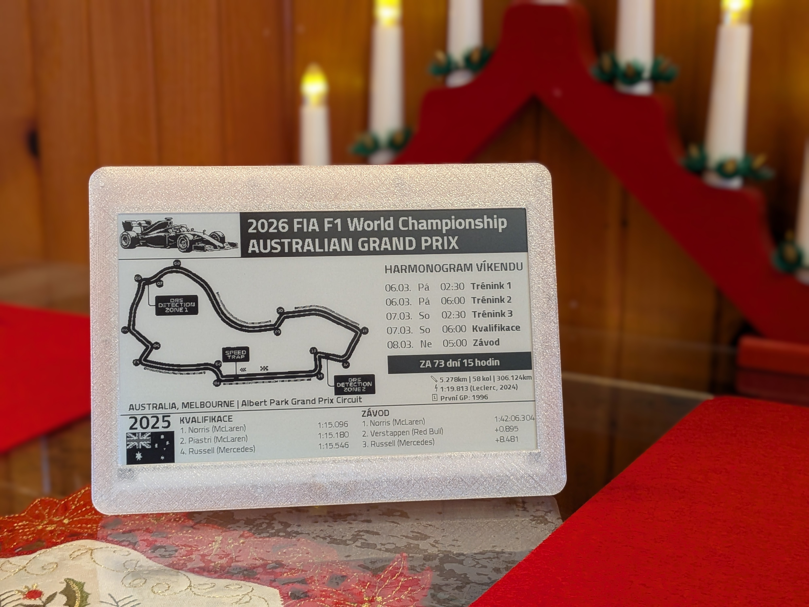

# F1 E-Ink Calendar

**Free F1 race calendar for your E-Ink display!** Use the public instance at **[f1.inkycloud.click](https://f1.inkycloud.click)** — no setup required.

[](https://f1.inkycloud.click)
[](./SELF-HOSTING.md)

---

## 🎯 Quick Start — Use It Now!

The easiest way to display the F1 calendar on your E-Ink device is to use our **free public instance**:

### For [zivyobraz.eu](https://zivyobraz.eu) Users

1. Register at [zivyobraz.eu](https://zivyobraz.eu) and add your ePaper device
2. In device settings, select **"URL"** as content source
3. Enter the calendar URL:
   ```
   https://f1.inkycloud.click/calendar.bmp?lang=cs
   ```
4. Done! Your E-Ink display will show the next F1 race 🏁

### URL Parameters

| Parameter | Options | Example |
|-----------|---------|---------|
| `lang` | `cs` (Czech), `en` (English) | `?lang=en` |
| `tz` | Any IANA timezone | `?tz=America/New_York` |
| `year` | Season year | `?year=2025` |
| `round` | Race round number | `?year=2025&round=5` |

**Examples:**
```
https://f1.inkycloud.click/calendar.bmp?lang=cs
https://f1.inkycloud.click/calendar.bmp?lang=en&tz=America/New_York
https://f1.inkycloud.click/calendar.bmp?lang=en&year=2025&round=5
```

---

## 📺 Preview



*LaskaKit 7.5" E-Ink display showing F1 race calendar in Czech*

---

## ✨ Features

- **800×480 1-bit BMP** — Optimized for E-Ink displays (LaskaKit)
- **Always Up-to-Date** — Automatically updated after each Grand Prix
- **Multi-language** — Czech and English support
- **Any Timezone** — Convert race times to your local timezone
- **Historical Results** — Previous year's podium for each circuit
- **Track Info** — Circuit map, length, laps, and first GP year
- **Session Schedule** — FP1, FP2, FP3, Qualifying, Sprint, Race times

### Roadmap

Planned features for future releases:

- [ ] **Multi-color E-Ink displays** — Support for red/black/white and other color variants
- [ ] **Additional display sizes** — Beyond 800×480 (e.g., 4.2", 5.83", 12.48")
- [ ] **More languages** — German, Spanish, Italian, and community translations
- [ ] **Driver standings widget** — Current championship standings view
- [ ] **Dark mode variant** — Inverted colors for different display preferences
- [ ] **Weather integration** — Race weekend weather forecast
- [ ] **Custom layouts** — Multiple layout options to choose from

---

## 🔌 ESP32 Integration

### Using zivyobraz.eu (Recommended)

Compatible with [zivyobraz.eu](https://zivyobraz.eu) — a service for managing ePaper displays with ESP32. See [documentation](https://wiki.zivyobraz.eu/doku.php?id=portal:url).

### Direct ESP32 Code

```cpp
#include <HTTPClient.h>

HTTPClient http;
http.begin("https://f1.inkycloud.click/calendar.bmp?lang=cs");
int httpCode = http.GET();

if (httpCode == HTTP_CODE_OK) {
  // Display on E-Ink
  display.drawBitmap(http.getStream());
}
```

---

## 🛠️ API Endpoints

The public instance at [f1.inkycloud.click](https://f1.inkycloud.click) provides these endpoints:

| Endpoint | Description |
|----------|-------------|
| `GET /calendar.bmp` | Generate F1 calendar as 1-bit BMP image |
| `GET /` | Interactive preview page with race selector |
| `GET /preview` | Static preview page |
| `GET /api` | API documentation |
| `GET /api/races/{year}` | All races for a season (JSON) |
| `GET /api/race/{year}/{round}` | Specific race details (JSON) |
| `GET /api/stats` | Request statistics |
| `GET /health` | Health check |

---

## 🏠 Self-Hosting

Want to run your own instance? We've got you covered!

👉 **[SELF-HOSTING.md](./SELF-HOSTING.md)** — Complete guide for self-hosting including:
- Quick start with Docker/Coolify
- Project structure
- Data updates & yearly maintenance
- Configuration reference
- Track images

### Quick Docker Start

```bash
git clone https://github.com/Rhiz3K/InkyCloud-F1.git
cd InkyCloud-F1
docker build -t f1-eink-cal .
docker run -p 8000:8000 f1-eink-cal
```

### Deployment Guides

- **[SELF-HOSTING.md](./SELF-HOSTING.md)** — Complete self-hosting guide
- **[COOLIFY.md](./COOLIFY.md)** — One-click Coolify deployment
- **[DEPLOYMENT.md](./DEPLOYMENT.md)** — Docker, cloud platforms, manual setup

---

## 📜 License

See [LICENSE](LICENSE) file for details.

## 🤝 Contributing

Contributions are welcome! See [CONTRIBUTING.md](./CONTRIBUTING.md) for guidelines.

## 🙏 Credits

- **Inspired by**: [FoxeeLab's original F1 E-Ink project](https://x.com/foxeelab/status/1761498129268981856) for [zivyobraz.eu](https://zivyobraz.eu)
- F1 data from [Jolpica F1 API](https://github.com/jolpica/jolpica-f1)
- Built for [LaskaKit](https://www.laskakit.cz/) E-Ink displays
- Public instance hosted on [Coolify](https://coolify.io) + [Hetzner](https://www.hetzner.com/)
