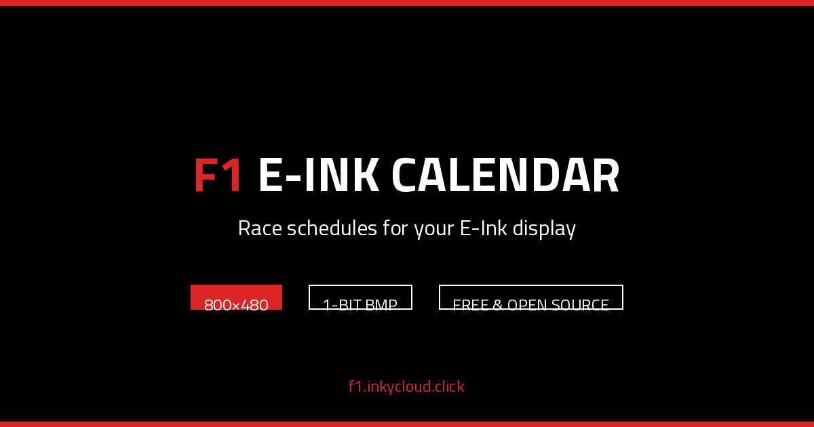

# F1 E-Ink Calendar

Calendar artwork now supports 18 styles, all 16 accent combinations, and reviewed
Jules Roy / Wikimedia Commons outlines for all 26 circuits. Defaults are isometric
relief, all four accents and Jules Roy. See [artwork API and licences](TRACK_ARTWORK.md).

Independent, noncommercial fan project for e-paper race calendars. Not affiliated with,
endorsed by or sponsored by the Formula One group, FIA, teams or drivers.

The project retains its F1.InkyCloud.click name and original car illustration, which
the maintainer identifies as AI-generated. Team logos identify the respective teams;
their separate rights status is recorded in [the asset notices](DATA_LICENSES.md).
Configure your actual `SITE_URL`; the examples use a reserved example domain.

[](./SELF-HOSTING.md)
[](https://codspeed.io/Rhiz3K/InkyCloud-F1?utm_source=badge)

---

## Quick Start — Use It Now!

Configure your deployed instance following [the self-hosting guide](SELF-HOSTING.md):

### For [zivyobraz.eu](https://zivyobraz.eu) Users

1. Register at [zivyobraz.eu](https://zivyobraz.eu) and add your ePaper device
2. In device settings, select **"URL"** as content source
3. Enter the calendar URL:
   ```
   https://racing.example.com/calendar.bmp?lang=cs
   ```
4. Done! Your E-Ink display will show the next F1 race 🏁

### URL Parameters

| Parameter      | Options                          | Example                              |
| -------------- | -------------------------------- | ------------------------------------ |
| `lang`         | `cs`, `de`, `en`, `es`, `fr`, `it`, `ja`, `nl`, `pl`, `pt-BR`, `sk`, `tr`, `zh-CN` | `?lang=sk` |
| `tz`           | Any IANA timezone                | `?tz=America/New_York`               |
| `year`         | Season year                      | `?year=2026`                         |
| `round`        | Race round number                | `?year=2026&round=5`                 |
| `race_key`     | Specific race key from `/api/races/{year}` (requires `year`) | `?year=2026&race_key=2026-round-5-monaco-2026-05-24` |
| `display`      | `1bit`, `bwr`, `bwry`, `spectra6` | `?display=bwry`                      |
| `weather`      | `true`, `false`                  | `?weather=false`                     |
| `weather_type` | `race_day`, `race`, `current`, `off` | `?weather=true&weather_type=current` |

**Examples:**

```text
https://racing.example.com/calendar.bmp?lang=cs
https://racing.example.com/calendar.bmp?lang=en&tz=America/New_York
https://racing.example.com/calendar.bmp?lang=en&year=2026&round=5
https://racing.example.com/calendar.bmp?lang=en&year=2026&race_key=2026-round-5-monaco-2026-05-24
https://racing.example.com/calendar.bmp?lang=en&display=bwr
https://racing.example.com/calendar.bmp?lang=en&display=bwry
https://racing.example.com/calendar.bmp?lang=en&display=spectra6
https://racing.example.com/calendar.bmp?lang=en&weather=true&weather_type=current
https://racing.example.com/teams.bmp?lang=ja&display=spectra6
https://racing.example.com/sk/configure/calendar
```

---

## Preview



---

## Features

- **800x480 BMP output** — `1bit` monochrome, `bwr` B/W/R, `bwry` B/W/R/Y, and `spectra6` 6-color mode for both calendar and teams screens
- **Teams & Drivers screen** — Dedicated `teams.bmp` render for the default or selected season with constructor lineup, plain driver numbers, and championship points
- **Localized UI and assets** — Routing, configure pages, previews, docs, and pregenerated BMPs support `cs`, `de`, `en`, `es`, `fr`, `it`, `ja`, `nl`, `pl`, `pt-BR`, `sk`, `tr`, and `zh-CN`
- **Hourly regeneration + startup warmup** — Calendar and teams assets are regenerated on startup and every hour, with version metadata refreshed hourly and teams render assets warmed on boot
- **Any Timezone** — Convert race times to your local timezone
- **Race Status States** — Upcoming countdown, `IN PROGRESS` / `PROBÍHÁ`, `COMPLETED` / `DOKONČEN`, and cancelled race handling
- **Optional Weather Overlay** — Current, race-day forecast, and historical race-time weather on the calendar screen
- **Historical Results** — Previous year's podium for each circuit
- **Track Info** — Licensed circuit map plus circuit length, lap count, first Grand Prix and lap record where available; data sources and rights notes are kept separately
- **Display-Specific Track Art** — reviewed Jules Roy and Commons outlines in all four display palettes, without F1 raster fallbacks
- **Interactive configure flow** — Localized `/configure/calendar` and `/configure/teams` pages with pregenerated previews, direct BMP URLs, weather/display switching, and season leaders sidebar
- **SEO-friendly public pages** — Canonical URLs, hreflang alternates, `robots.txt`, and a localized `sitemap.xml` without synthetic daily `lastmod` churn
- **Session Schedule** — FP1, FP2, FP3, Qualifying, Sprint, Race times

### Roadmap

Planned features for future releases:

#### Display colors

- [x] **1-BIT monochrome** — Initial calendar output introduced in `v1.0.0`
- [x] **Spectra 6** — `display=spectra6` added in `v1.2.0`
- [x] **B/W/R** — `display=bwr` added in `v1.2.9`
- [x] **B/W/R/Y** — `display=bwry` added in `v1.2.13` for the calendar screen and extended to the teams screen in `v1.2.15`

#### Screens and layouts

- [x] **Championship standings** — Driver and constructor standings view
- [x] **Teams & Drivers screen** — Full team grid with plain driver numbers and points
- [ ] **Custom layouts** — Multiple layout options to choose from
- [ ] **Additional display sizes** — Beyond 800x480 (e.g. 4.2", 5.83", 12.48")

#### Content and localization

- [ ] **More languages** — Additional community/localized translations beyond the current 13 supported locales
- [ ] **Extended weather integration** — Richer race weekend weather and extra weekend details
- [ ] **Dark mode variant** — Inverted colors for different display preferences

---

## ESP32 Integration

### Using zivyobraz.eu (Recommended)

Compatible with [zivyobraz.eu](https://zivyobraz.eu) — a service for managing ePaper displays with ESP32. See [documentation](https://wiki.zivyobraz.eu/doku.php?id=portal:url).

### Direct ESP32 Code

```cpp
#include <HTTPClient.h>

HTTPClient http;
http.begin("https://racing.example.com/calendar.bmp?lang=cs");
const char* responseHeaders[] = {"ETag"};
http.collectHeaders(responseHeaders, 1);

String etag = loadEtagFromPreferences();  // Persist across deep-sleep cycles.
if (!etag.isEmpty()) {
  http.addHeader("If-None-Match", etag);
}
int httpCode = http.GET();

if (httpCode == HTTP_CODE_OK) {
  saveEtagToPreferences(http.header("ETag"));
  display.drawBitmap(http.getStream());
} else if (httpCode == HTTP_CODE_NOT_MODIFIED) {
  // The BMP is unchanged: skip both the download and disruptive panel redraw.
}
```

Calendar and teams responses use a strong SHA-256 `ETag`. Send it back in `If-None-Match`; an
unchanged image returns `304 Not Modified` with an empty body. Persist the ETag in NVS/Preferences,
because an ESP32 commonly sleeps between polls. A changed race, weather view, language, timezone,
or renderer output returns `200` with a new ETag. Teams deliberately use `Cache-Control: no-cache`,
which permits conditional revalidation without accepting a stale response.

---

## Public Routes and API Endpoints

The public instance at [racing.example.com](https://racing.example.com) provides these endpoints:

| Endpoint                                 | Description                                             |
| ---------------------------------------- | ------------------------------------------------------- |
| `GET /calendar.bmp`                      | Calendar BMP with `lang`, `year`, `round`, `race_key`, `display`, `weather`, and `tz` params |
| `GET /teams.bmp`                         | Teams & drivers grid as BMP image (`lang`, `year`, `display`) |
| `GET /`                                  | Landing page with screen type selection                 |
| `GET /configure/{screen}`                | Interactive localized preview/config page (calendar/teams) |
| `GET /stats`                             | Public usage statistics dashboard                       |
| `GET /privacy`                           | Privacy policy page                                     |
| `GET /changelog`                         | Public changelog page                                   |
| `GET /preview/{screen}.png`              | Pre-generated localized homepage preview PNG            |
| `GET /preview/configure/{screen}.png`    | Pre-generated localized configure preview PNG           |
| `GET /api`                               | JSON API documentation                                  |
| `GET /api/docs`                          | Alias for `/api`                                        |
| `GET /api/docs/html`                     | Interactive HTML API docs                               |
| `GET /api/races/{year}`                  | All races for a season (JSON)                           |
| `GET /api/race/{year}/{round}`           | Specific race details (JSON)                            |
| `GET /api/teams/{year}`                  | Teams and drivers for a season (JSON)                   |
| `GET /api/standings/leader`              | Current championship leader (JSON)                      |
| `GET /api/standings/leader/{year}`       | Championship leader for a specific season (JSON)        |
| `GET /api/stats`                         | Request statistics, 200/304 status totals and map style/source/accent usage |
| `GET /api/stats/history`                 | Historical hourly request statistics                    |
| `POST /api/perf-metrics`                 | Retired; returns 410 without storing telemetry    |
| `GET /api/perf-metrics`                  | Performance summaries; 410 only in minimal mode            |
| `GET /robots.txt`                        | Crawler policy with canonical sitemap reference         |
| `GET /sitemap.xml`                       | Localized sitemap with canonical URLs and hreflang alternates |
| `GET /sw.js`                             | Service worker script                                   |
| `GET /health`                            | Process liveness                                        |
| `GET /health/ready`                      | SQLite, storage, and core-generation readiness/degradation |

Statistics and their read APIs are available by default with `MINIMAL_DATA_MODE=false`
and `AGGREGATE_STATS_ONLY=true`. They store hourly usage totals and coarse performance
histograms without visitor identifiers. `POST /api/perf-metrics` accepts numeric measurements
only; a random 10% sample of page loads sends one report. When `ADMIN_API_TOKEN` is configured,
read-only statistics APIs require `X-Admin-Token` or `Authorization: Bearer <token>`.
Explicit `MINIMAL_DATA_MODE=true` makes the statistics page and all statistics APIs return 410.

Core calendar BMPs and PNG previews are published before optional upstream lookups. Weather
and teams enrichment have total budgets of 15 and 30 seconds, configurable with
`WEATHER_ENRICHMENT_TIMEOUT_SECONDS` and `TEAMS_ENRICHMENT_TIMEOUT_SECONDS`. A timeout keeps
core readiness available and marks generation degraded. Preview metadata sidecars bind each
PNG to the current race and source BMP and preserve the source's six-hour freshness limit;
missing or stale configure previews fall back to rendering the requested BMP.

The persistent circuit snapshot takes current metadata and new circuits from the bundled
release, while retaining newer historical results and runtime-only circuits. Startup migrates
old individual usage records into hourly totals and removes their identifiers from the active
SQLite database, including when image scheduling is disabled. Sport data and weather quotas
remain. Previously deleted statistics cannot be recovered by changing flags.

Language preferences are saved in localStorage and a functional cookie independently of
analytics, and the browser detects its timezone. Optional Umami receives only hourly server
summaries; optional GlitchTip receives scrubbed errors with tracing/profiling disabled.
Application/access logs remain disabled, and rate limits use shared 60-second counters without
IP keys. Backups require explicit configuration and bounded retention. External provider logs,
old backups and snapshots require separate configuration and cleanup.

See [data collection and upgrades](docs/data-collection.md) for retention, optional
integrations and a read-only runtime check. Configure privacy notices and provider
arrangements for your own deployment.


---

## Self-Hosting

Production, CI, and local development use **Python 3.14**. Released containers are published to
GHCR with immutable version and commit tags, an SBOM, and provenance.

### Quick Docker Start

```bash
git clone https://github.com/Rhiz3K/InkyCloud-F1.git
cd InkyCloud-F1
cp .env.example .env
F1_IMAGE=ghcr.io/rhiz3k/inkycloud-f1:vX.Y.Z docker compose pull
F1_IMAGE=ghcr.io/rhiz3k/inkycloud-f1:vX.Y.Z docker compose up -d --no-build
```

### Deployment Guides

- **[DEPLOYMENT.md](./DEPLOYMENT.md)** — choose the correct deployment path
- **[SELF-HOSTING.md](./SELF-HOSTING.md)** — Docker, operations, backups, and development
- **[COOLIFY.md](./COOLIFY.md)** — image-based Coolify deployment and rollback
- **[.env.example](./.env.example)** — canonical environment-variable reference
- **[scripts/README.md](./scripts/README.md)** — maintenance and unified asset CLI
- **[BMP_PROCESSING.md](./BMP_PROCESSING.md)** — source-art and runtime BMP pipeline

---

## License

See [LICENSE](LICENSE) file for details.

## Contributing

Contributions are welcome! See [CONTRIBUTING.md](./CONTRIBUTING.md) for guidelines.

## Credits

- **Inspiration:** [FoxeeLab's original F1 E-Ink project](https://x.com/foxeelab/status/1761498129268981856)
- **Race data:** [Jolpica-F1 API](https://github.com/jolpica/jolpica-f1)
- **Weather:** [Open-Meteo](https://open-meteo.com)
- **Icons:** [Weather Icons](https://github.com/erikflowers/weather-icons) by Erik Flowers (SIL OFL 1.1)
- **Flags:** [Flagcdn](https://flagcdn.com)
- **Platform:** [Živýobraz.eu](https://zivyobraz.eu)
- **Devices:** [LaskaKit](https://www.laskakit.cz/) and [SVERIO](https://pajenicko.cz/sverio-paperboard-ctyrbarevny-7.5-gdem075f52-s-cernym-rameckem)
- **Hosting:** [Coolify](https://coolify.io) + [Hetzner](https://www.hetzner.com/)

## Rights and privacy

Software is MIT; this does not relicense data, map artwork, fonts or dependencies.
Read [data licences](DATA_LICENSES.md), [third-party notices](THIRD_PARTY_NOTICES.md)
and [data collection](docs/data-collection.md). Optional analytics receives only hourly
server summaries. The default profile retains aggregate operational statistics.
Commercial deployments must independently resolve the noncommercial data conditions.
