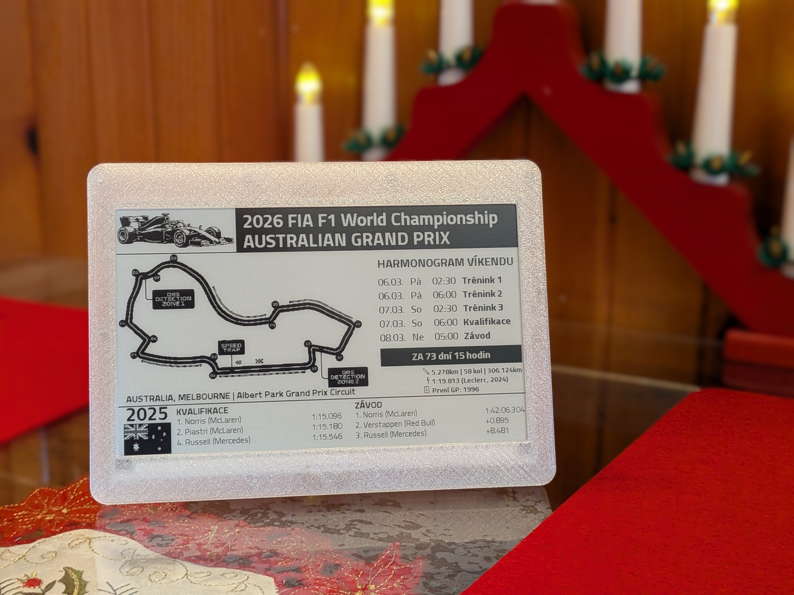

# F1 E-Ink Calendar

**Free F1 race calendar for your E-Ink display!** Use the public instance at **[f1.inkycloud.click](https://f1.inkycloud.click)** — no setup required.

[](https://f1.inkycloud.click)
[](./SELF-HOSTING.md)
[](https://codspeed.io/Rhiz3K/InkyCloud-F1?utm_source=badge)

---

## 🎯 Quick Start — Use It Now!

The easiest way to display the F1 calendar on your E-Ink device is to use our **free public instance**:

### For [zivyobraz.eu](https://zivyobraz.eu) Users

1. Register at [zivyobraz.eu](https://zivyobraz.eu) and add your ePaper device
2. In device settings, select **"URL"** as content source
3. Enter the calendar URL:
   ```
   https://f1.inkycloud.click/calendar.bmp?lang=cs
   ```
4. Done! Your E-Ink display will show the next F1 race 🏁

### URL Parameters

| Parameter      | Options                          | Example                              |
| -------------- | -------------------------------- | ------------------------------------ |
| `lang`         | `cs` (Czech), `en` (English)     | `?lang=en`                           |
| `tz`           | Any IANA timezone                | `?tz=America/New_York`               |
| `year`         | Season year                      | `?year=2026`                         |
| `round`        | Race round number                | `?year=2026&round=5`                 |
| `display`      | `1bit`, `bwr`, `spectra6`        | `?display=bwr`                       |
| `weather`      | `true`, `false`                  | `?weather=false`                     |
| `weather_type` | `race_day`, `current`            | `?weather=true&weather_type=current` |

**Examples:**

```text
https://f1.inkycloud.click/calendar.bmp?lang=cs
https://f1.inkycloud.click/calendar.bmp?lang=en&tz=America/New_York
https://f1.inkycloud.click/calendar.bmp?lang=en&year=2026&round=5
https://f1.inkycloud.click/calendar.bmp?lang=en&display=bwr
https://f1.inkycloud.click/calendar.bmp?lang=en&display=spectra6
https://f1.inkycloud.click/calendar.bmp?lang=en&weather=true&weather_type=current
```

---

## 📺 Preview



_LaskaKit 7.5" E-Ink display showing F1 race calendar in Czech_

---

## ✨ Features

- **800x480 BMP output** — `1bit` monochrome, `bwr` B/W/R, and `spectra6` 6-color mode for the calendar screen
- **Teams & Drivers screen** — Dedicated `teams.bmp` standings/lineup render for the current or selected season
- **Always Up-to-Date** — Automatically updated after each Grand Prix
- **Multi-language** — Czech and English support
- **Any Timezone** — Convert race times to your local timezone
- **Race Status States** — Upcoming countdown, `IN PROGRESS` / `PROBIHA`, `COMPLETED` / `DOKONCEN`, and cancelled race handling
- **Optional Weather Overlay** — Current, race-day forecast, and historical race-time weather on the calendar screen
- **Historical Results** — Previous year's podium for each circuit
- **Track Info** — Circuit map, length, laps, and first GP year
- **Session Schedule** — FP1, FP2, FP3, Qualifying, Sprint, Race times

### Roadmap

Planned features for future releases:

#### Display colors

- [x] **1-BIT monochrome** — Initial calendar output introduced in `v1.0.0`
- [x] **Spectra 6** — `display=spectra6` added in `v1.2.0`
- [x] **B/W/R** — `display=bwr` added in `v1.2.9`
- [ ] **B/W/R/Y** — Planned next color-mode expansion

#### Screens and layouts

- [x] **Championship standings** — Driver and constructor standings view
- [x] **Teams & Drivers screen** — Full team grid with driver photos and points
- [ ] **Custom layouts** — Multiple layout options to choose from
- [ ] **Additional display sizes** — Beyond 800x480 (e.g. 4.2", 5.83", 12.48")

#### Content and localization

- [ ] **More languages** — German, Spanish, Italian, and community translations
- [ ] **Extended weather integration** — Richer race weekend weather and extra weekend details
- [ ] **Dark mode variant** — Inverted colors for different display preferences

---

## 🔌 ESP32 Integration

### Using zivyobraz.eu (Recommended)

Compatible with [zivyobraz.eu](https://zivyobraz.eu) — a service for managing ePaper displays with ESP32. See [documentation](https://wiki.zivyobraz.eu/doku.php?id=portal:url).

### Direct ESP32 Code

```cpp
#include <HTTPClient.h>

HTTPClient http;
http.begin("https://f1.inkycloud.click/calendar.bmp?lang=cs");
int httpCode = http.GET();

if (httpCode == HTTP_CODE_OK) {
  // Display on E-Ink
  display.drawBitmap(http.getStream());
}
```

---

## 🛠️ API Endpoints

The public instance at [f1.inkycloud.click](https://f1.inkycloud.click) provides these endpoints:

| Endpoint                                 | Description                                             |
| ---------------------------------------- | ------------------------------------------------------- |
| `GET /calendar.bmp`                      | Calendar BMP with `display`, `weather`, and `tz` params |
| `GET /teams.bmp`                         | Teams & drivers grid as 1-bit BMP image (`lang`, `year`) |
| `GET /`                                  | Landing page with screen type selection                 |
| `GET /configure/{screen}`                | Interactive preview page (calendar/teams)               |
| `GET /preview/{screen}.png`              | Pre-generated preview PNG                               |
| `GET /preview/configure/{screen}.png`    | Pre-generated configure preview PNG                     |
| `GET /api`                               | JSON API documentation                                  |
| `GET /api/docs`                          | Alias for `/api`                                        |
| `GET /api/docs/html`                     | Interactive HTML API docs                               |
| `GET /api/races/{year}`                  | All races for a season (JSON)                           |
| `GET /api/race/{year}/{round}`           | Specific race details (JSON)                            |
| `GET /api/teams/{year}`                  | Teams and drivers for a season (JSON)                   |
| `GET /api/standings/leader`              | Current championship leader (JSON)                      |
| `GET /api/standings/leader/{year}`       | Championship leader for a specific season (JSON)        |
| `GET /api/stats`                         | Request statistics                                      |
| `GET /api/stats/history`                 | Historical hourly request statistics                    |
| `POST /api/perf-metrics`                 | Store frontend performance metrics (Core Web Vitals)    |
| `GET /api/perf-metrics`                  | Read aggregated frontend performance metrics            |
| `GET /health`                            | Health check                                            |

---

## 🏠 Self-Hosting

Want to run your own instance? We've got you covered!

Local development requires **Python 3.14.3+**.

👉 **[SELF-HOSTING.md](./SELF-HOSTING.md)** — Complete guide for self-hosting including:

- Quick start with Docker/Coolify
- Project structure
- Data updates & yearly maintenance
- Configuration reference
- Track images

### Quick Docker Start

```bash
git clone https://github.com/Rhiz3K/InkyCloud-F1.git
cd InkyCloud-F1
docker build -t f1-eink-cal .
docker run -p 8000:8000 f1-eink-cal
```

### Deployment Guides

- **[SELF-HOSTING.md](./SELF-HOSTING.md)** — Complete self-hosting guide
- **[COOLIFY.md](./COOLIFY.md)** — One-click Coolify deployment
- **[DEPLOYMENT.md](./DEPLOYMENT.md)** — Docker, cloud platforms, manual setup

---

## 📜 License

See [LICENSE](LICENSE) file for details.

## 🤝 Contributing

Contributions are welcome! See [CONTRIBUTING.md](./CONTRIBUTING.md) for guidelines.

## 🙏 Credits

- **Inspired by**: [FoxeeLab's original F1 E-Ink project](https://x.com/foxeelab/status/1761498129268981856) for [zivyobraz.eu](https://zivyobraz.eu)
- F1 data from [Jolpica F1 API](https://github.com/jolpica/jolpica-f1)
- Weather forecast data from [Open-Meteo](https://open-meteo.com)
- Weather icons from [Weather Icons](https://github.com/erikflowers/weather-icons) by Erik Flowers (SIL OFL 1.1)
- Built for [LaskaKit](https://www.laskakit.cz/) E-Ink displays
- Public instance hosted on [Coolify](https://coolify.io) + [Hetzner](https://www.hetzner.com/)
